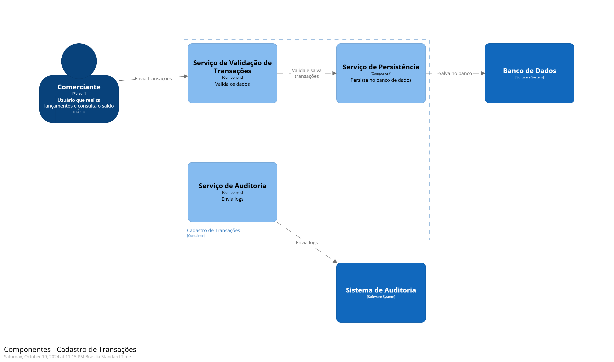

# Arquitetura Alvo - Sistema de Controle de Fluxo de Caixa

A **Arquitetura Alvo** representa a visão futura do sistema, descrevendo como todos os componentes, sistemas e atores interagem para atender aos requisitos funcionais e não funcionais. Este documento oferece um desenho completo da solução com base nos **domínios funcionais**, **capacidades de negócio** e **requisitos refinados**. O desenho está estruturado conforme a abordagem **C4** (Contexto, Containers, Componentes e Código) para fornecer uma visão clara e abrangente do sistema.

## 1. Diagrama de Contexto (C1) – Visão Geral do Sistema

O diagrama de contexto fornece uma visão geral do sistema no seu ambiente operacional, incluindo os principais atores e sistemas externos com os quais o sistema interage.

### Estrutura:

- **Comerciante**: Usuário principal que interage com o sistema para registrar transações e consultar relatórios.
- **Sistema de Controle de Fluxo de Caixa**: Sistema principal, que gerencia transações financeiras e consolida os dados diariamente.
- **Sistema de Auditoria**: Sistema externo para onde os logs de auditoria são enviados.
- **Banco de Dados**: Sistema de armazenamento de transações.

.png)

### Explicação:

- O **Comerciante** interage com o **Sistema de Controle de Fluxo de Caixa** para registrar novas transações e consultar relatórios.
- O sistema se comunica com o **Sistema de Auditoria** para enviar logs e com o **Banco de Dados** para armazenar e consultar transações.

---

## 2. Diagrama de Containers (C2) – Estrutura do Sistema

O diagrama de containers detalha os principais containers dentro do sistema, como as aplicações e o banco de dados. Estes containers incluem:

- **Cadastro de Transações**: Gerencia o registro e a validação das transações.
- **Consolidado Diário**: Consolida as transações e gera relatórios diários.
- **Banco de Dados**: Armazena as transações de forma durável.

.png)

### Explicação:

- **Cadastro de Transações**: O comerciante interage diretamente para registrar novas transações, que são validadas e salvas no banco de dados.
- **Consolidado Diário**: Consolida as transações do dia e gera relatórios, consultando o banco de dados e exibindo os resultados ao comerciante.

---

## 3. Diagrama de Componentes (C3) – Detalhamento Interno dos Containers

O diagrama de componentes foca nos detalhes internos dos containers. Os principais componentes incluem:

- **Serviço de Validação de Transações**: Valida transações recebidas no cadastro.
- **Serviço de Persistência de Transações**: Persiste as transações no banco de dados.
- **Serviço de Consolidação**: Consolida transações diárias e realiza cálculos.
- **Serviço de Relatório**: Gera relatórios consolidados.

### Explicação:

- **Serviço de Validação**: Recebe as transações do comerciante e realiza as validações necessárias.
- **Serviço de Persistência**: Salva os dados validados no banco de dados de forma durável.
- **Serviço de Consolidação**: Recupera e processa todas as transações do dia para gerar um saldo consolidado.
- **Serviço de Relatório**: Gera os relatórios financeiros que são exibidos ao comerciante.

---

## Arquitetura Alvo - Resumo

1. **Contexto (C1)**: O sistema principal e seus relacionamentos com sistemas externos e o comerciante.
2. **Containers (C2)**: A estrutura interna do sistema, incluindo Cadastro de Transações, Consolidado Diário e Banco de Dados.
3. **Componentes (C3)**: O detalhamento interno dos containers, mostrando como os componentes se comunicam para realizar operações como validação, persistência e geração de relatórios.

---

## Próximos Passos:

1. **Testes de Integração**: Certificar-se de que todos os componentes estão corretamente integrados e se comunicam de maneira eficaz.
2. **Monitoramento**: Implementar um sistema de monitoramento para garantir a operação contínua e o rastreamento de erros em tempo real.
3. **Documentação Técnica**: Finalizar a documentação técnica detalhada para desenvolvedores e operadores, garantindo que todas as operações e funcionalidades do sistema estejam devidamente documentadas.