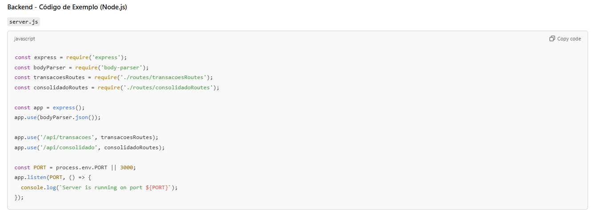
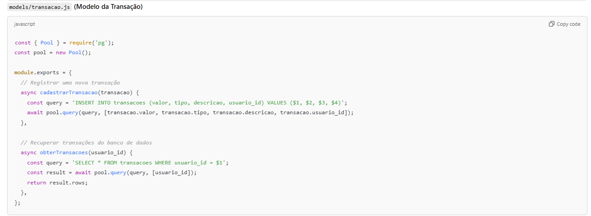
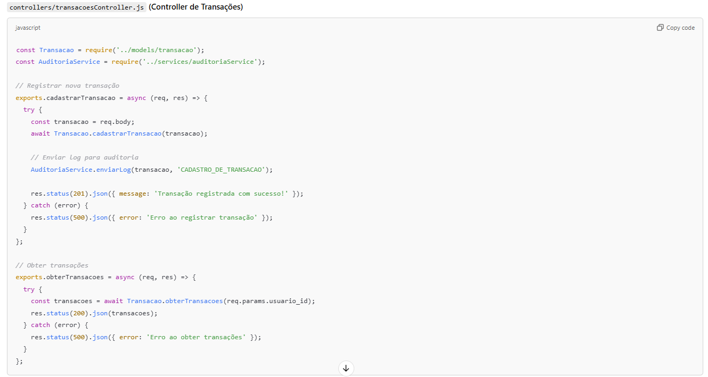
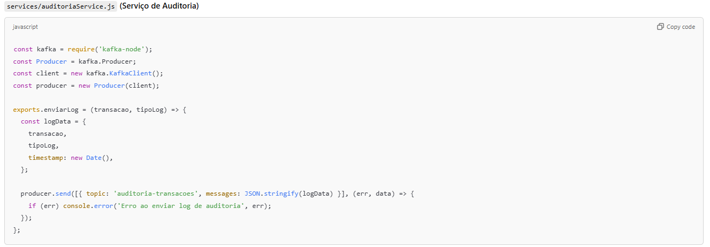
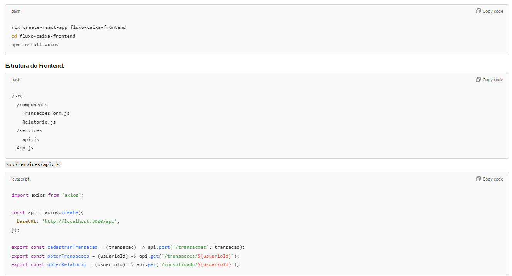

# Sistema de Controle de Fluxo de Caixa

## Arquitetura Alvo - Stack Proposto

### Frontend: React.js (JavaScript)
### Backend: Node.js com Express (JavaScript/TypeScript)
### Banco de Dados: PostgreSQL (Relacional)
### Mensageria: Kafka (Para comunicação assíncrona entre serviços)
### Autenticação/Autorização: OAuth 2.0 e JWT
### Auditoria e Monitoramento: Elastic Stack (ELK: Elasticsearch, Logstash, Kibana)

---

## 1. Estruturação da Solução

### Backend (Node.js + Express)

O **backend** em Node.js gerencia todas as operações de negócio e persistência de dados. Ele expõe **APIs RESTful** para o frontend (React.js), permite o registro e consulta de transações, envia logs de auditoria para o **Elastic Stack** e lida com transações no banco de dados.

#### Diagrama do Backend:

#### Kafka Configuration:

O **Kafka** é usado para comunicação assíncrona entre o **Cadastro de Transações** e o sistema de Auditoria. Isso garante que os logs das transações sejam enviados de maneira não bloqueante, oferecendo maior resiliência e desempenho.

#### PostgreSQL:

Usamos **PostgreSQL** como banco de dados relacional para garantir **transações ACID**, permitindo que todas as transações financeiras sejam validadas e persistidas com segurança e integridade.

#### ELK Stack para Logs de Auditoria:

O **Elastic Stack (ELK)** é configurado para receber os logs de transações do **Kafka**. Usamos **Logstash** para processar os logs e armazená-los no **Elasticsearch**, onde podem ser visualizados no **Kibana**. Isso proporciona uma maneira eficiente de monitorar as transações e rastrear atividades para fins de auditoria.

---

## 2. Frontend (React.js)

O **frontend** será implementado usando **React.js**, que consumirá as APIs REST do backend, permitindo ao comerciante registrar transações e visualizar relatórios consolidados.

#### Diagrama do Frontend:

### Estruturação da Interface:

O frontend oferece uma interface amigável e intuitiva para o comerciante, permitindo o **registro de transações** e a **consulta de relatórios financeiros consolidados**. A interface se comunica diretamente com o backend para persistir e consultar os dados financeiros.

---

## 3. Justificativa das Tecnologias

### Node.js + Express:
- Permite construir **APIs RESTful** de maneira rápida e eficiente.
- **Alta escalabilidade** com suporte a operações assíncronas, tornando o backend robusto e eficiente para processar grandes volumes de dados em tempo real.

### React.js:
- Proporciona uma **interface de usuário reativa e moderna**, essencial para um **bom UX** (Experiência do Usuário), especialmente em sistemas críticos como controle de fluxo de caixa.
- Facilita a integração com APIs backend, permitindo uma comunicação eficiente entre frontend e backend.

### Kafka:
- Escolhido por sua robustez em processar **grandes volumes de mensagens** de forma distribuída e com alta resiliência.
- Permite que o sistema opere de forma **assíncrona**, garantindo que operações críticas, como envio de logs de auditoria, não afetem o desempenho geral.

### PostgreSQL:
- A capacidade de suportar **transações ACID** torna-o ideal para o armazenamento de dados financeiros críticos, garantindo integridade, consistência e confiabilidade dos dados.

### Elastic Stack (ELK):
- Permite **monitoramento robusto** dos logs de auditoria, garantindo conformidade com normas de segurança e **rastreamento de atividades** para fins de auditoria.
- Oferece uma plataforma centralizada para **buscar, monitorar e visualizar** logs com o **Kibana**, facilitando a detecção de anomalias e a manutenção da integridade do sistema.

---

## Conclusão

Este projeto arquitetônico e tecnológico foi projetado para garantir que o **Sistema de Controle de Fluxo de Caixa** seja **escalável**, **seguro** e **fácil de manter**. As ferramentas foram cuidadosamente escolhidas para atender aos requisitos de desempenho, escalabilidade e confiabilidade, garantindo uma arquitetura moderna e eficiente para lidar com transações financeiras críticas.

As tecnologias escolhidas – **Node.js, React, Kafka, PostgreSQL** e **Elastic Stack** – proporcionam uma solução robusta e flexível, capaz de crescer e evoluir conforme as necessidades do sistema aumentam.
