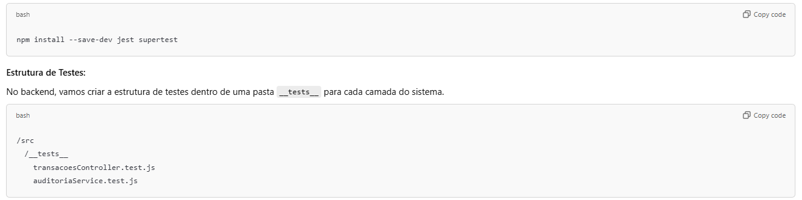
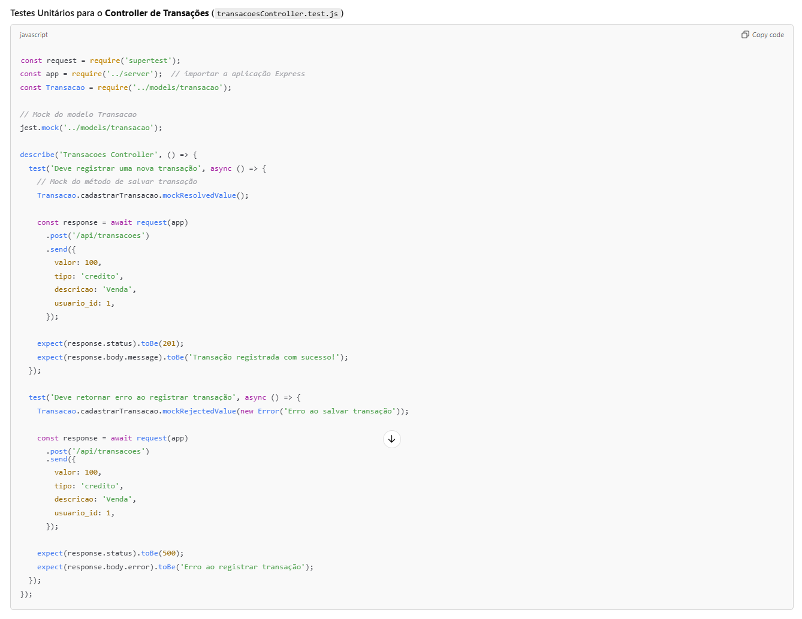
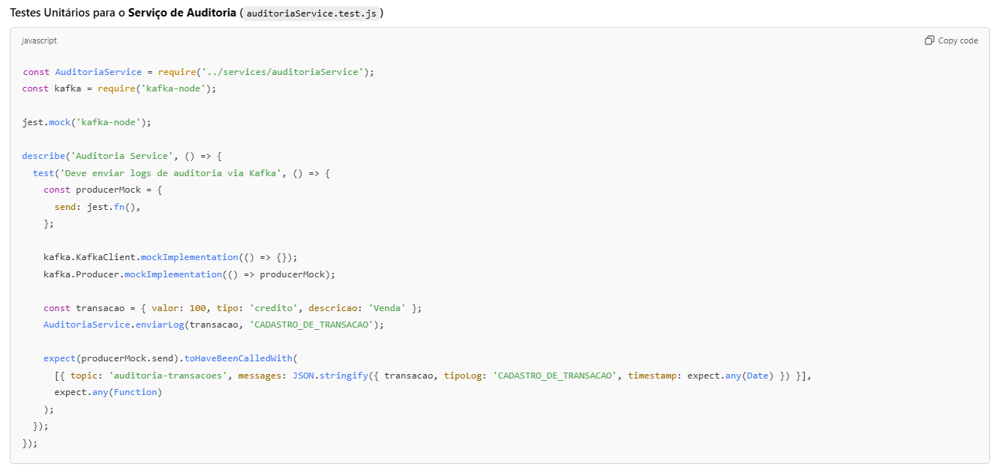
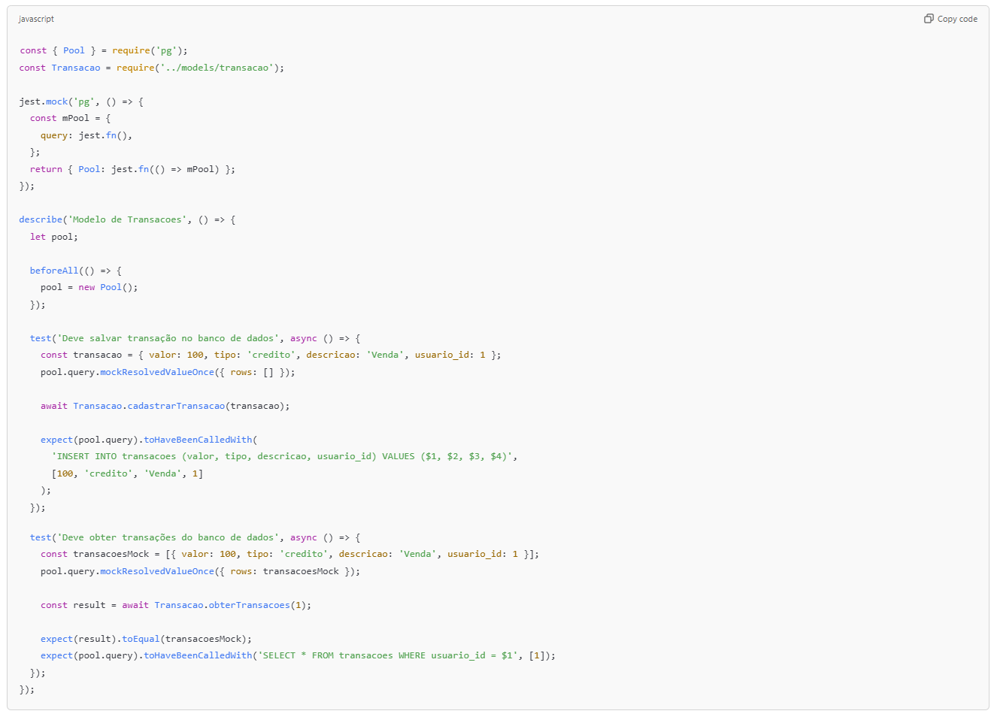
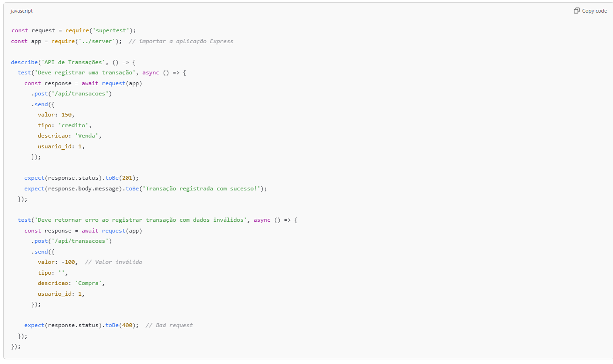
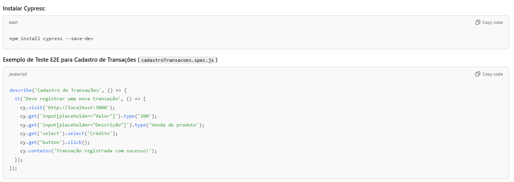
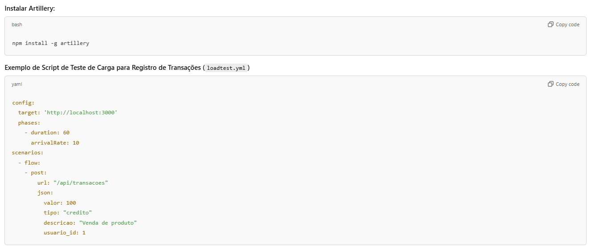
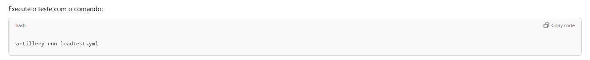

# Estratégia de Testes para o Sistema de Controle de Fluxo de Caixa

Os testes são uma parte fundamental do ciclo de desenvolvimento, garantindo que o sistema funcione conforme esperado, e que seja seguro, escalável e confiável. Para o **Sistema de Controle de Fluxo de Caixa**, vamos adotar uma estratégia de testes abrangente, que inclui:

- **Testes Unitários**: Para testar componentes individuais do backend e frontend.
- **Testes de Integração**: Para verificar a comunicação entre componentes do sistema, como o backend, banco de dados e Kafka.
- **Testes de API**: Para garantir que as APIs REST estão funcionando corretamente.
- **Testes End-to-End (E2E)**: Para garantir que o sistema como um todo funcione de ponta a ponta, do frontend ao backend e banco de dados.
- **Testes de Carga e Performance**: Para verificar se o sistema se comporta bem sob cargas pesadas e se atende aos requisitos de desempenho.
- **Testes de Segurança**: Para garantir que o sistema esteja seguro, com foco em autenticação, autorização e auditoria.

---

## 1. Testes Unitários (Backend)

Vamos começar configurando testes unitários para o backend. Usaremos o **Jest** e o **Supertest** para escrever testes e fazer chamadas simuladas às APIs.

### Exemplos de Modelos:
### Modelo:

### continuação Modelo:

### continuação Modelo:

---

## 2. Testes de Integração

Nos testes de integração, garantimos que os componentes do sistema estão funcionando corretamente quando interagem entre si, como as APIs que se comunicam com o banco de dados **PostgreSQL** e o **Kafka**.

### Teste de Integração para o Modelo de Transações (transacao.test.js)
Este teste verifica se o modelo de transações interage corretamente com o PostgreSQL.

### Modelo:

---

## 3. Testes de API

**Supertest** será usado para garantir que as APIs estão respondendo corretamente, verificando se as rotas e os controladores funcionam como esperado.

### Modelo:

---

## 4. Testes End-to-End (E2E)

**Cypress** será utilizado para realizar testes end-to-end, simulando o comportamento real do usuário no navegador, como o registro de transações e consulta de relatórios.

### Modelo:

---

## 5. Testes de Performance e Carga

**Artillery** será utilizado para realizar testes de carga e verificar como o sistema se comporta sob uma grande quantidade de requisições.

### Exemplos de Modelos:

### Modelo:

### continuação Modelo:

---

## 6. Testes de Segurança

- **Testes de Autenticação/Autorização**: Simular tentativas de acesso sem autenticação usando **Supertest** e verificar se o sistema bloqueia requisições não autorizadas.
  
- **Verificação de Criptografia de Dados**: Verificar se as informações sensíveis (como senhas) estão sendo armazenadas corretamente usando hashing (como **bcrypt**).

---

## Conclusão

Esta estratégia de testes cobre todas as áreas críticas do sistema, garantindo que tanto as transações financeiras quanto as funcionalidades de auditoria funcionem conforme esperado. Testes unitários, de integração, E2E, e de carga ajudam a garantir a **robustez**, **desempenho**, e **segurança** da solução de Controle de Fluxo de Caixa.
