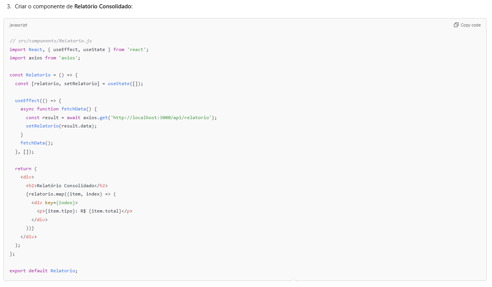

# Controle de Fluxo de Caixa

Este projeto implementa um sistema simples de controle de fluxo de caixa, permitindo o gerenciamento de transações diárias de débitos e créditos, além de gerar relatórios consolidados de saldo diário. O sistema é composto por um backend em Node.js e Express, conectado a um banco de dados PostgreSQL, e um frontend em React.js.

## Funcionalidades

- **Cadastro de Débitos e Créditos**: API para lançamentos de transações.
- **Cálculo de Saldo Diário**: Geração automática do saldo consolidado de cada dia.
- **Relatórios Consolidados**: Exibição de relatórios com saldo diário e histórico de transações.

## Estrutura do Projeto

### Modelo de Dados
Abaixo está o modelo de dados do projeto:


### Diagrama de API de Lançamentos
A API permite o cadastro e visualização de transações e saldo.


## Desenvolvimento da Aplicação

### Backend: Node.js + Express + PostgreSQL
O backend é desenvolvido usando Node.js, com o framework Express, e utiliza o PostgreSQL como banco de dados.

1. **Configuração do Backend**:
   - Instale as dependências:
     ```bash
     npm install
     ```
   - Configure a conexão com o banco de dados PostgreSQL.
   - Rodar a aplicação:
     ```bash
     npm start
     ```

2. **APIs Disponíveis**:
   - `POST /transacoes`: Para cadastrar uma transação (débito ou crédito).
   - `GET /saldo`: Para obter o saldo diário consolidado.

### Frontend: React.js
O frontend é construído em React.js e permite a visualização e interação com os dados de fluxo de caixa.

1. **Configuração do Frontend**:
   - Instale as dependências:
     ```bash
     npm install
     ```
   - Rodar o aplicativo:
     ```bash
     npm start
     ```

### Modelos de Telas
Abaixo estão os modelos das principais telas do sistema:

#### Tela de Transações


#### Tela de Relatório de Saldo Diário


#### Tela de Cadastro de Transações


## Hospedagem do Projeto

### Passo 1: Criar o Repositório no Servidor
- Crie um repositório público em uma plataforma de versionamento (ex.: GitHub).
- Acesse o Repositório e faça login.
- Clique no botão + no canto superior direito e selecione New repository.
- Dê um nome ao repositório, como fluxo-caixa, e selecione Public.
- Clique em Create repository.

### Passo 2: Enviar o Projeto para o Servidor
- Faça o push do projeto para o repositório criado:
