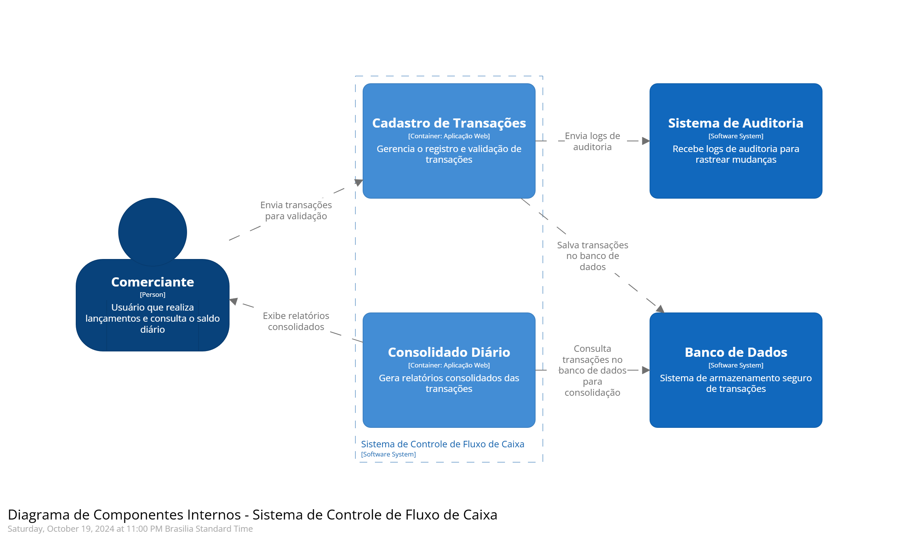

### Diagrama de Contexto C4 (Camada 1)

Este README descreve a **primeira camada** do modelo C4, o **Diagrama de Contexto do Sistema**. Ele ilustra uma visão de alto nível do **Sistema de Controle de Fluxo de Caixa**, mostrando os principais atores (usuários ou outros sistemas) que interagem com o sistema e como essas interações ocorrem.

## Elementos Principais:

- **Sistema de Controle de Fluxo de Caixa**: O sistema principal que gerencia os fluxos financeiros. Ele é dividido em dois grandes subsistemas:
  - **Controle de Lançamentos**: Gerencia o registro de débitos, créditos e outras transações financeiras.
  - **Consolidado Diário**: Consolida todas as transações diárias e gera relatórios financeiros.

- **Comerciante (Usuário)**: O usuário principal do sistema, responsável por realizar lançamentos e consultar o saldo consolidado diário.

- **Sistema Bancário Externo (Opcional)**: Um sistema externo de onde o comerciante pode importar ou exportar dados de transações financeiras, facilitando a integração bancária.

- **Sistema de Auditoria**: Um sistema ou serviço externo que recebe logs e relatórios detalhados dos lançamentos para fins de compliance ou auditoria.

## Explicação:

1. **Comerciante**: Interage com o **Sistema de Controle de Fluxo de Caixa**, especificamente com os subsistemas de:
   - **Controle de Lançamentos**: Para registrar débitos, créditos e outras transações financeiras.
   - **Consolidado Diário**: Para consultar o saldo diário consolidado das transações realizadas.

2. **Sistema Bancário Externo**: Pode ser usado para importar ou exportar dados financeiros, facilitando a integração dos dados bancários com o controle de caixa.

3. **Sistema de Auditoria**: Recebe logs das transações realizadas no sistema, garantindo que os registros possam ser auditados e estejam em conformidade com as regulamentações.

---

## Próximos Passos:

### 1. **Diagrama de Containers (Camada 2)**:
  Podemos detalhar os principais containers deste sistema, como as aplicações, bancos de dados e interfaces externas que operam no **Sistema de Controle de Fluxo de Caixa**.

  

### 2. **Diagrama de Componentes (Camada 3)**:
  Podemos detalhar os componentes internos de cada subsistema, como serviços de validação de transações, processamento de relatórios e outros serviços necessários para garantir o funcionamento correto do sistema.

  

### 3. **Diagrama de Código (Camada 4)**:
  Se necessário, podemos detalhar implementações específicas no nível de código, incluindo as interações entre classes, módulos e bibliotecas que compõem os componentes do sistema.

  
