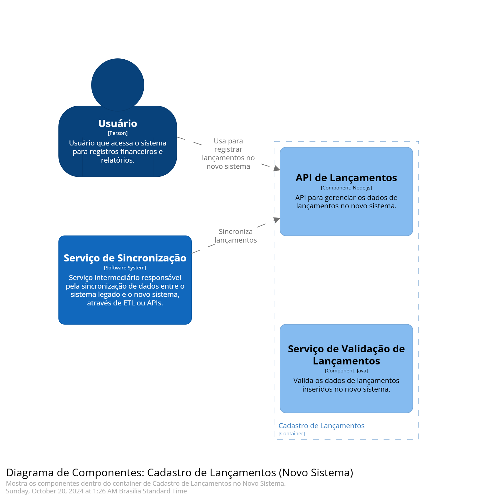
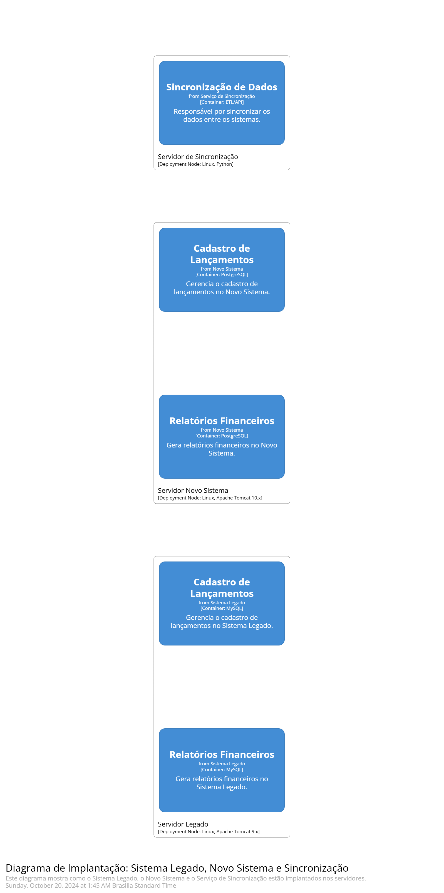

# Arquitetura de Transição para Migração de Sistema Legado

Este documento descreve a arquitetura de transição para a migração de um sistema legado para um novo sistema. A transição é realizada de forma controlada, minimizando interrupções nas operações e garantindo a integridade dos dados. A migração é gradual, com convivência entre o sistema legado e o novo sistema.

## 1. Fase de Convivência dos Sistemas (Legado + Novo Sistema)

Durante esta fase, o sistema legado e o novo sistema coexistem:

- **Integração através de um Serviço de Sincronização**:
  - Um middleware, ETL ou API é criado para transferir dados entre os dois sistemas.
  
- **Manutenção do Sistema Legado**:
  - O sistema legado continua operando, sendo utilizado pelos usuários para as operações de negócios.

- **Novo Sistema Gradualmente Introduzido**:
  - Partes do novo sistema são introduzidas gradualmente, permitindo testes e uso por parte dos usuários.

- **Sincronização Bidirecional**:
  - As mudanças feitas no sistema legado são sincronizadas com o novo sistema e vice-versa, garantindo integridade dos dados.

.png)

---

## 2. Componentes de Transição

- **Sistema Legado**:
  - Gerencia funcionalidades essenciais como cadastro de dados e relatórios financeiros.

- **Novo Sistema**:
  - Assume gradualmente funcionalidades críticas, como módulos de cadastro ou relatórios aprimorados.

- **Serviço de Sincronização**:
  - Um serviço intermediário que sincroniza dados entre o sistema legado e o novo sistema em tempo real ou em lotes (ETL).

- **Banco de Dados Híbrido**:
  - Durante a transição, parte dos dados permanece no sistema legado (ex.: MySQL) e novas funcionalidades são movidas para o novo sistema (ex.: PostgreSQL).

.png)

---

## 3. Fases da Arquitetura de Transição

### Fase 1: Preparação

- Criar o serviço de sincronização para manter os dados consistentes entre os dois sistemas.
- Preparar os dados no sistema legado para exportação e integração com o novo sistema.
- Testar a compatibilidade entre os dois sistemas.

### Fase 2: Convivência

- O sistema legado continua funcionando.
- O novo sistema é introduzido gradualmente em módulos (ex.: novo sistema assume o cadastro de dados, enquanto o legado ainda gera relatórios).
- A sincronização de dados mantém ambos os sistemas atualizados.

### Fase 3: Migração Completa

- Quando o novo sistema estiver completamente funcional, a migração completa dos dados do sistema legado será realizada.
- Desligamento do sistema legado após a conclusão da migração.

---

## 4. Desenho de Solução para a Arquitetura de Transição

### Sistema Legado (MySQL/SQL)

- Processa transações e consultas antigas.
- É utilizado pelos usuários para processos ainda não migrados.
- Sincroniza dados com o novo sistema via serviço de sincronização.

### Novo Sistema (PostgreSQL)

- Gradualmente assume novos módulos e funcionalidades.
- Utiliza um banco de dados moderno, mais escalável e com maior capacidade de integração.

### Serviço de Sincronização (ETL/API)

- Sincroniza as transações e dados entre o sistema legado e o novo sistema.
- Pode realizar sincronização bidirecional ou em lotes para garantir a consistência dos dados.

---

## 5. Usuários

- Durante a fase de convivência, os usuários continuam utilizando o sistema legado.
- Gradualmente, os usuários passam a acessar o novo sistema à medida que os módulos migram.

---

## Diagrama Arquitetônico de Transição

Abaixo está um exemplo de diagrama visual que representa a arquitetura de transição.

### Sistema Legado

- Módulo de cadastro de dados.
- Relatórios financeiros.
- Banco de dados MySQL/SQL.

### Novo Sistema

- Módulo de cadastro de dados (novo).
- Relatórios financeiros (novo).
- Banco de dados PostgreSQL.

### Serviço de Sincronização

- Sincroniza os dados de lançamentos e relatórios entre o sistema legado e o novo sistema.

---

## 6. Passos Adicionais para Arquitetura de Transição

### Monitoramento e Logs

- Configuração de monitoramento e logs para garantir que o processo de migração e sincronização funcione corretamente.

### Testes de Migração

- Testes de migração devem ser realizados para garantir a transferência precisa de dados.

### Rollback

- Planejar um processo de rollback no caso de falha na migração, para garantir que os dados não sejam comprometidos.

---

## Conclusão

A arquitetura de transição permite uma migração gradual e segura de um sistema legado para um novo sistema, minimizando interrupções no ambiente de produção e garantindo a integridade dos dados. Esta abordagem oferece uma fase de convivência entre os sistemas e a possibilidade de rollback em caso de falha durante o processo.
